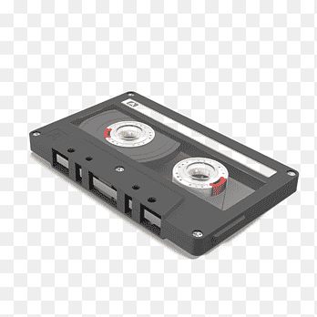
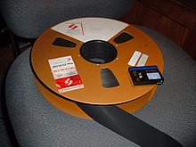
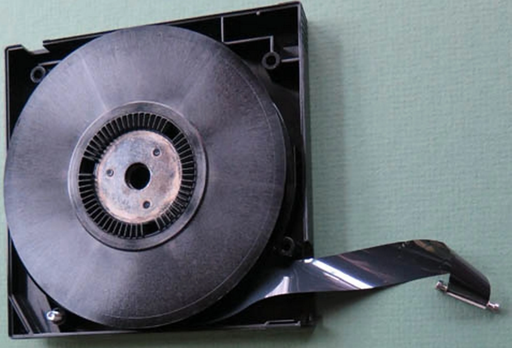

## Tipos de Cintas Magnéticas

* Cinta de audio: 

La empresa Phillips introdujo los primeros pequeños cartuchos de cintas de cassette y las grabadoras portátiles de cinta al público a principios de 1960. 

* Cinta de video: 

Ampex introdujo la primera grabadora de video en cinta funcional y producida en masa, la VRX-1000, en el año 1956. 

* Cinta de almacenamiento de datos:

El primer uso de la cinta magnética para almacenar datos ocurrió en 1951, en un proto-ordenador Ilamado Mauchly-Eckert UNIVACI
